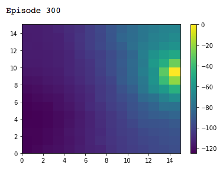
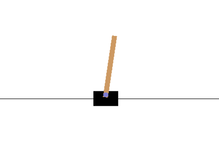

# Myelin

A Python Framework for Reinforcement Learning.

## Agents

- [TD0](https://github.com/davidrobles/myelin/blob/master/myelin/agents/td0.py)
- [Q-learning](https://github.com/davidrobles/myelin/blob/master/myelin/agents/qlearning.py)
- [SARSA](https://github.com/davidrobles/myelin/blob/master/myelin/agents/sarsa.py)
- [ExpectedSARSA](https://github.com/davidrobles/myelin/blob/master/myelin/agents/expected_sarsa.py)
- [First-visit Monte Carlo](https://github.com/davidrobles/myelin/blob/master/myelin/agents/first_visit_mc.py)
- [Every-visit Monte Carlo](https://github.com/davidrobles/myelin/blob/master/myelin/agents/every_visit_mc.py)

## Examples

### GridWorld

- [Grid World - TD0](https://github.com/davidrobles/myelin/blob/master/examples/grid_world_td0.ipynb)
- [Grid World - QLearning](https://github.com/davidrobles/myelin/blob/master/examples/grid_world_qlearning.ipynb)
- [Grid World - SARSA](https://github.com/davidrobles/myelin/blob/master/examples/grid_world_sarsa.ipynb)
- [Grid World - ExpectedSARSA](https://github.com/davidrobles/myelin/blob/master/examples/grid_world_expected_sarsa.ipynb)
- [Grid World - First-Visit Monte Carlo](https://github.com/davidrobles/myelin/blob/master/examples/grid_world_first_visit_monte_carlo.ipynb)
- [Grid World - Every-Visit Monte Carlo](https://github.com/davidrobles/myelin/blob/master/examples/grid_world_every_visit_monte_carlo.ipynb)

### Pole Balancing

- [Cart-Pole - Q-learning](https://github.com/davidrobles/myelin/blob/master/examples/cart_pole_qlearning.py)

## Why the name Myelin?

Neuroscience research has shown that brain circuits that get used extensively are **reinforced** by growing
a **myelin** sheath around them – the myelin provides insulation for those neural pathways and improves
the speed at which those neural pathways fire. In other words, as we repeat and get better at an
activity, there is a physiological change that speeds up the signals in our brain so that we can do it
faster.
